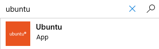

# Ansible Windows Facts

A repository for Ansible playbook that gathers Linux facts using the Ansible setup module.
Creates the following output using the facts:

* RAW JSON
* RAW YAML
* Formatted CSV (select fields)
* Formated Markdown (select fields)
* Interactive HTML Mind Map (select fields)

Copywrite John Capobianco July 26,2020

## Instructions for Linux users

### Linux / Ansible Host prequisites

These playbooks have been developed and tested under Ansble 2.9.1 on CentOS 7.8.2003

You will require Git, Ansible, Node.js 12, and Mark Map on your Linux / Ansible host.

## REFERENCES

Ansible Setup - Gather Facts - https://docs.ansible.com/ansible/latest/modules/setup_module.html

It is very important when prompted for your username that you use username@MY.DOMAIN.COM. This whole string is case sensitive and the domain portion *must* be in upper case.

#### Install steps - CentOS

1. Update yum

$ sudo yum -y update

2. Install Ansible

$ sudo yum install epel-release
$ sudo yum install ansible

3. Install node.js 12

$ curl -sL https://rpm.nodesource.com/setup_12.x | sudo bash -
$ sudo yum install -y gcc-c++ make
$ sudo yum install -y nodejs

4. Install Mark Map

$ npm install markmap-lib -g

#### Install steps - Ubuntu

1. Update Ubuntu - this step will take some time. 

$ sudo apt update
$ sudo apt-get upgrade -y

2. Make sure Python is installed.

$ sudo apt-get install python -y

3. Install Ansible.

$ sudo apt-add-repository ppa:ansible/ansible
$ sudo apt-get update
$ sudo apt-get install ansible -y

4. Install node.js

$ sudo apt install npm

5. Install Mark Map 

$ npm install markmap-lib -g

## Instructions for Windows Users

### Windows Prequisites

These playbooks require the Windows Subsystems for Linux and the Ubuntu OS from the Microsoft Store.
Aside from this requirement, the Linux prequisites similarly apply to Windows 10.

#### Install Steps - Windows 10

1. Right-click the Windows Start icon - select Apps and Features.

2. In the Apps and Features window - click Programs and Features under Related Settings on the right side of Apps and Features.

3. Click Turn Windows Features On or Off in the left (with the shield icon) side of the Programs and Features window.

4. Scroll to bottom of the Features window and put a check mark beside Windows Subsytem for Linux; Click Ok and close the open windows.

5. Launch the Microsoft Store.

6. Search for Ubuntu - click the first result.

7. Click Install.

8. Wait for Ubuntu to install.

9. Press Windows Key and start typing Ubuntu - click and launch Ubuntu.

10. The first time Ubuntu launches it has to setup - give this some time.

11. Enter your username and password for Ubuntu.

12. Update Ubuntu - this step will take some time. 

$ sudo apt update

$ sudo apt-get upgrade -y

13. Make sure Python is installed.

$ sudo apt-get install python -y

14. Install Ansible.

$ sudo apt-add-repository ppa:ansible/ansible

$ sudo apt-get update

$ sudo apt-get install ansible -y

15. Install node.js.

$ sudo apt install npm

16. Install Mark Map.

$ sudo npm install markmap-lib -g

## Clone the repository

1. git clone https://github.com/automateyournetwork/LinuxFacts.git

2. Modify the permissions.

chmod -R 755 /home/"username"/LinuxFacts

3. Ubuntu Bug fix.

To work around a bug that prevents the Ansible playbook from running on certain versions of Ubuntu please run the following:

sudo mv /usr/bin/sleep /usr/bin/sleep.dist
sudo ln -s /bin/true /usr/bin/sleep

## Run the playbook(s)

1. Update your hosts file and include the Linux hostname under [LINUX]. If FQDN is required for the Ansible Linux host please use the FQDN.

[LINUX]

yourhost.your.domain.com

2. cd LinuxFacts/playbooks

### All Hosts

ansible-playbook LinuxFacts.yml

Provide your domain username@YOUR.DOMAIN.COM

**EXTREMELY_IMPORTANT_NOTE**

The username above is case sensitive and *must* include the @YOUR.DOMAIN.COM or the kerberos token will be invalid and the playbook will fail. 

Provide your domain password.

The playbook will run.

Provide a Git Commit Message.

Provide your Git repository username.

Provide your Git repository password.

### Select Hosts

ansible-playbook LinuxFacts.yml --limit <host>

Provide your domain username@YOUR.DOMAIN.COM

**EXTREMELY_IMPORTANT_NOTE**

The username above is case sensitive and *must* include the @YOUR.DOMAIN.COM or the kerberos token will be invalid and the playbook will fail.

Provide your domain password.

The playbook will run.

Provide a Git Commit Message.

Provide your Git repository username.

Provide your Git repository password.

## Review the reports

The Reports are stored in documentation/servers/LINUX/.

/csv

Contains comma separated format. Fully searchable / sortable / filterable.

/json

Contains the RAW JSON from the Ansible Facts.

/markdown

Contains mark down format.

/mindmaps

Contains HTML mind maps best viewed in Google Chrome.

/yaml

Contains the RAW YAML from the Ansible Facts.
